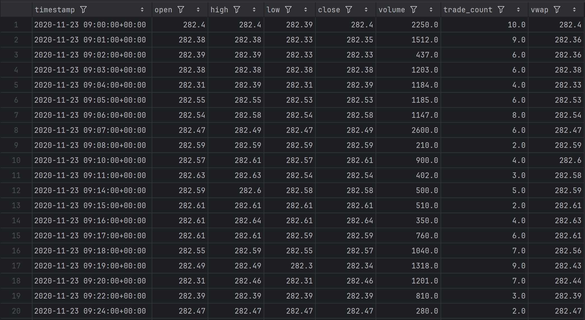

# NASDAQ Trading Bot mit Machine Learning

## Problem Definition:

### Target

### Input Features

## Procedure Overview:

---

## Step 1 - Data Acquisition

Ruft historische 1 Minuten-Kerzendaten für einen NASDAQ-100 (QQQ) von 2020-11-23 bis 2025-11-20 ab und speichert sie als Parquet-Dateien.

### Skript

[scripts/01_data_acquisition/bar_retriever.py](nasdaq_trading_bot/scripts/01_data_acquisition/fetch_nasdaq_index.py)

### Bar-Daten Beispiel

---

## Step 2 - Data Understanding

