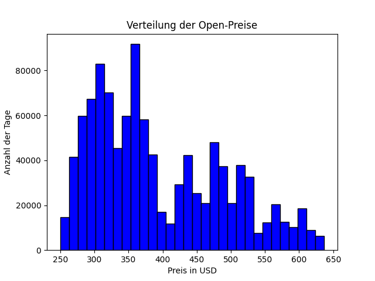
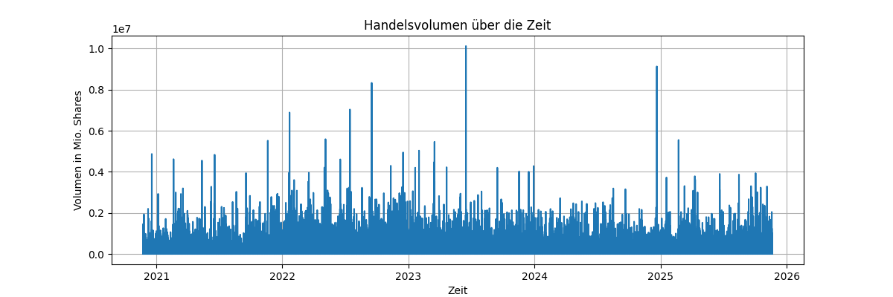
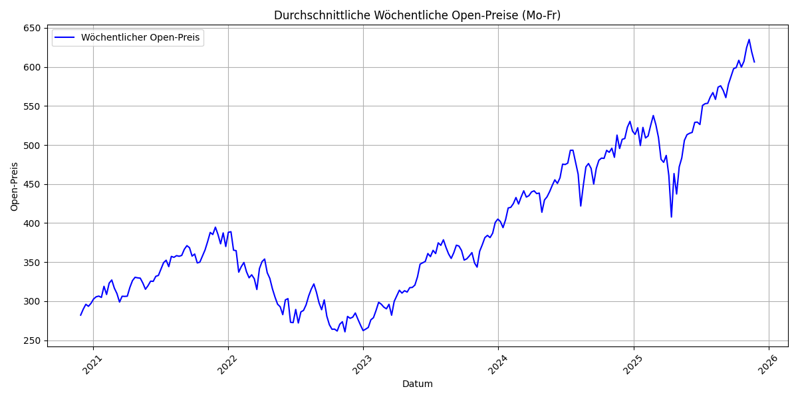
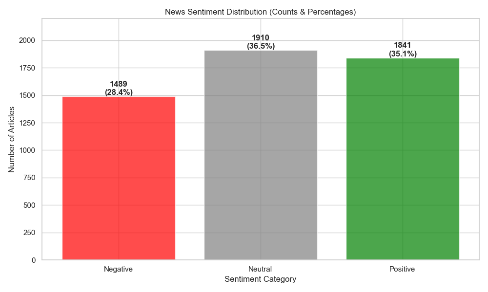
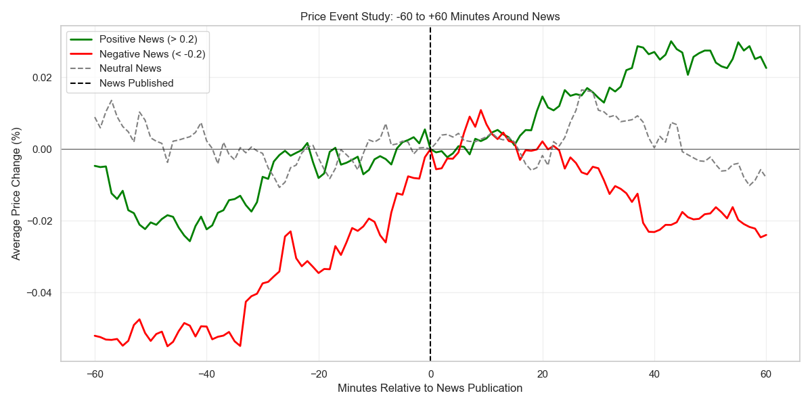
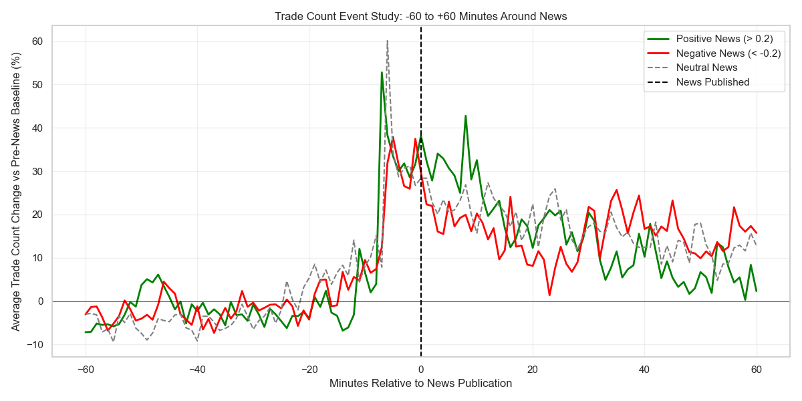
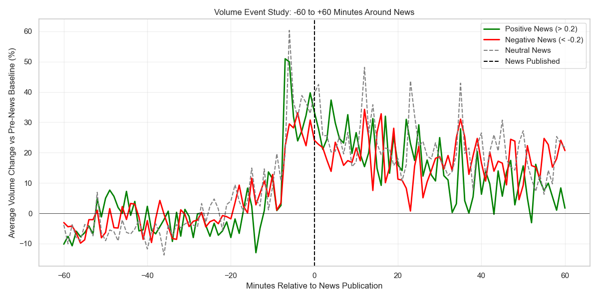

# NASDAQ Trading Bot mit Machine Learning

## Problem Definition:

Wir möchten für QQQ vorhersagen, wie sich der Preis in den nächsten
1, 3, 5, 10 und 15 Minuten bewegt.
Das Ziel ist eine kurzfristige Daytrading-Prognose, mit der man Trends früh erkennt.

Wir nutzen dafür Minuten-Daten und News, um Muster wie Momentum, Volatilität oder News-Impulse zu erkennen.

### Ziel

Ein Modell zu entwickeln, das:

- Preis- und Volumenmuster erkennt

- News-Einfluss kurzfristig berücksichtigt

- zuverlässig abschätzt, wohin sich QQQ in den nächsten Minuten bewegt

Damit können wir präzisere Daytrading-Signale erzeugen.

### Input   

Wir verwenden 1-Minuten-Bars:

- `timestamp`

- `open`

- `high`

- `low`

- `close`

- `volume`

- `trade_count`

- `vwap`

Zusätzlich nutzen wir News:

- `news_time`

- `sentiment`

### Input Features

#### Preis- und Trendfeatures

- 1-, 5- und 15-Minuten Returns

- EMA(5) und EMA(20)

- Unterschied zwischen kurzen und langen EMAs

- Realisierte Volatilität der letzten 10 Minuten

- High-Low-Range der aktuellen Minute

#### Volumen-Features

- Volumen-Z-Score über die letzten 30 Minuten

- Volumen pro Trade

#### News-Feature

- Effektives News-Sentiment (letzte News, abgeschwächt je älter sie ist)

### Output

Wir erstellen für jede Minute fünf Zielwerte:

- erwartete Preisänderung in 1 Minute

- erwartete Preisänderung in 3 Minuten

- erwartete Preisänderung in 5 Minuten

- erwartete Preisänderung in 10 Minuten

- erwartete Preisänderung in 15 Minuten
---

## 1 - Data Acquisition

Ruft historische 1 Minuten-Kerzendaten für einen NASDAQ-100 (QQQ) von 2020-11-23 bis 2025-11-20 ab. Die erfassten Markdaten werden sowohl im Parquet-Format als auch CSV-Format unter `nasdaq_trading_bot/data` gespeichert. 
Die Daten werden mit fester Endzeit geladen, um reproduzierbare Ergebnisse zu gewährleisten.

### Skript - Nasdaq Bar Fetcher

[scripts/01_data_acquisition/fetch_nasdaq_index.py](nasdaq_trading_bot/scripts/01_data_acquisition/fetch_nasdaq_index.py)

### Bar-Daten Beispiel

| timestamp                 | open    | high    | low     | close   | volume  | trade_count | vwap    |
|---------------------------|--------|--------|--------|--------|--------|-------------|--------|
| 2020-11-23 09:00:00+00:00 | 282.40 | 282.40 | 282.39 | 282.40 | 2250.0 | 10.0        | 282.40 |
| 2020-11-23 09:01:00+00:00 | 282.38 | 282.38 | 282.33 | 282.35 | 1512.0 | 9.0         | 282.36 |
| 2020-11-23 09:02:00+00:00 | 282.39 | 282.39 | 282.33 | 282.33 | 437.0  | 6.0         | 282.36 |
| 2020-11-23 09:03:00+00:00 | 282.38 | 282.38 | 282.38 | 282.38 | 1203.0 | 6.0         | 282.38 |
| 2020-11-23 09:04:00+00:00 | 282.31 | 282.39 | 282.31 | 282.39 | 1184.0 | 4.0         | 282.33 |
| 2020-11-23 09:05:00+00:00 | 282.55 | 282.55 | 282.53 | 282.53 | 1185.0 | 6.0         | 282.53 |
| 2020-11-23 09:06:00+00:00 | 282.54 | 282.58 | 282.54 | 282.58 | 1147.0 | 8.0         | 282.54 |
| 2020-11-23 09:07:00+00:00 | 282.47 | 282.49 | 282.47 | 282.49 | 2600.0 | 6.0         | 282.47 |
| 2020-11-23 09:08:00+00:00 | 282.59 | 282.59 | 282.59 | 282.59 | 210.0  | 2.0         | 282.59 |
| 2020-11-23 09:10:00+00:00 | 282.57 | 282.61 | 282.57 | 282.61 | 900.0  | 4.0         | 282.60 |

### Skript - Nasdaq News Fetcher

[scripts/01_data_acquisition/fetch_news.py](nasdaq_trading_bot/scripts/01_data_acquisition/fetch_news.py)

### News-Daten Beispiel

| id | headline | summary | author | created_at | updated_at | url | symbols | source |
|----|----------|----------|--------|------------|------------|-----|----------|--------|
| 48963075 | S&P And Nasdaq Move Higher After Hours Foll… | nan | Benzinga Newsdesk | 2025-11-19T21:24:34Z | 2025-11-19T21:24:35Z | https://www.benzinga.com/general/macro-news/... | ['QQQ','SPY'] | benzinga |
| 48961392 | AI Powerhouses Or Small-Cap Rebound? ETF… | Morgan Stanley&#39;s 7,800 S&amp;P 500 cal… | Chandrima Sanyal | 2025-11-19T20:38:40Z | 2025-11-19T20:38:41Z | https://www.benzinga.com/etfs/broad-u-s-e… | ['AAPL','EQL','EQWL','IJR','IWM','MSFT','QQQ'] | benzinga |
| 48956738 | Tech Edges Up Ahead Of Nvidia's Earnings, Bi… | All eyes are on Nvidia Corp. (NASDAQ:NVDA)… | Piero Cingari | 2025-11-19T17:45:59Z | 2025-11-19T17:46:00Z | https://www.benzinga.com/news/25/11/489… | ['ACM','AMTM','AS','BRBR','BTC','BTCUSD'] | benzinga |
| 48944099 | Stock Market Today: Dow Jones, S&P 500 Fut… | Editor's note: The future prices of benchmar… | Rishabh Mishra | 2025-11-19T13:03:47Z | 2025-11-19T13:03:47Z | https://www.benzinga.com/markets/equities… | ['IBUD','BTCUSD','CEG','DASH','NVDA','QQQ'] | benzinga |
| 48925309 | How To Trade SPY, Top Tech Stocks Using T… | … | RIPS | 2025-11-19T15:09:28Z | 2025-11-19T13:23:18Z | https://www.benzinga.com/Opinion/25/11/489… | ['AAPL','GOOGL','META','MSFT','NVDA','QQQ'] | benzinga |
| 48943359 | Top Economist Warns Trump Tariffs Effectiv… | Yale Budget Lab: 2025 Trump tariffs hit poor… | Rishabh Mishra | 2025-11-19T08:49:17Z | 2025-11-19T08:49:18Z | https://www.benzinga.com/markets/economi… | ['QQQ','SPY'] | benzinga |
| 48936136 | Nvidia's Big Earnings Test: ETF Market Braces… | Nvidia&#39;s earnings could spark a record $… | Chandrima Sanyal | 2025-11-18T20:37:51Z | 2025-11-18T20:37:52Z | https://www.benzinga.com/etfs/25/11/489… | ['NVDA','QQQ','SPY','VOO'] | benzinga |
| 48932450 | Tech Stocks Drop, Pharma Gains As Sector R… | Wall Street endured another wave of selling… | Piero Cingari | 2025-11-18T18:15:12Z | 2025-11-18T15:11Z | https://www.benzinga.com/market… | ['AMGN','AMZN','BTCUSD','DECK','DIA','FC…'] | benzinga |
| 48930265 | Nvidia Sneezed, All ETFs Shivered — Is This t… | Here&#39;s how ETFs are positioned as inves… | Chandrima Sanyal | 2025-11-18T17:06:17Z | 2025-11-18T17:06:18Z | https://www.benzinga.com/etfs/sectors-etfs… | ['BUG','CIBR','GOOGL','IGV','META','MSFT','…'] | benzinga |
| 48929811 | Nvidia Earnings Will Determine Market Directio… | Key Earnings Data | The Arora Report | 2025-11-18T15:59:41Z | 2025-11-18T15:59:42Z | https://www.benzinga.com/market… | ['AAPL','AMZN','BTCUSD','GLD','GOOG','HD…'] | benzinga |
| 48926431 | Cloudflare Stumbled — And Tech Stocks Exte… | Cloudflare outage hit major platforms and tec… | Piero Cingari | 2025-11-18T15:28:09Z | 2025-11-18T15:28:09Z | https://www.benzinga.com/news/25/11/489… | ['AIQ','ALAB','AMD','AMZN','APP','ARM','CL…'] | benzinga |
| 48918136 | Stock Market Today: Dow Jones, S&P 500, Na… | Editor&#39;s note: The future prices of benchm… | Rishabh Mishra | 2025-11-18T13:27:46Z | 2025-11-18T13:28:09Z | https://www.benzinga.com/markets/equities… | ['AVTR','AXTA','BTCUSD','HD','HP','MOH',…] | benzinga |
| 48916726 | Fed's Waller Backs Rate Cut In December Amid… | Fed&#39;s Waller supports a December rate c… | Rishabh Mishra | 2025-11-18T03:23:08Z | 2025-11-18T03:23:09Z | https://www.benzinga.com/markets/macro-e… | ['DIA','NVDA','QQQ','SPY'] | benzinga |
| 48970509 | Nvidia Q3 Preview: Analysts Predict Beat And … | Nvidia&#39;s Q3 earnings on Wednesday repr… | Chris Katje | 2025-11-17T19:08:09Z | 2025-11-17T19:08:10Z | https://www.benzinga.com/trading-ideas/… | ['DIA','NVDA','QQQ','SPY'] | benzinga |
| 48905126 | Alphabet Rallies To Record Highs, Bitcoin F… | Wall Street kicked off the new week on a flat n… | Piero Cingari | 2025-11-17T17:40:53Z | 2025-11-17T17:40:54Z | https://www.benzinga.com/markets/equities… | ['ALB','BTCUSD','CNC','COIN','DELL','DIA','…'] | benzinga |
| 48936057 | Dip Buyers Save The Stock Market; Hindenbur… | Dip Buyers Save The Market | The Arora Report | 2025-11-17T16:54:55Z | 2025-11-17T16:54:55Z | https://www.benzinga.com/etfs/d… | ['AAPL','AMZN','APLD','BRK','BTCUSD','GLD…'] | benzinga |
| 48930233 | US ETF Inflows Hit Record Pace—VOO, SPY,… | VOO, SPY and QQQ are driving record U.S. ET… | Chandrima Sanyal | 2025-11-17T16:41:43Z | 2025-11-17T16:41:43Z | https://www.benzinga.com/etfs/broad-u-s-e… | ['AGG','BND','GLD','GOVT','IBIT','IEF','QQQ…'] | benzinga |
| 48931843 | Stock Market Today: Dow, Nasdaq Futures Ri… | Editor’s Note: The future prices of benchm… | Rishabh Mishra | 2025-11-17T13:36:33Z | 2025-11-17T16:31:43Z | https://www.benzinga.com/Opinion/25/11/489… | ['BA','BRK','BTCUSD','DELL','GOOG','QQQ'] | benzinga |
| 48987619 | How To Trade SPY, Top Tech Stocks Using T… | … | RIPS | 2025-11-17T13:35:08Z | 2025-11-17T13:35:08Z | https://www.benzinga.com/etfs/sectors/… | ['AAPL','GOOGL','META','MSFT','NVDA','QQQ'] | benzinga |
| 48982486 | Howard Marks Draws Parallels Between AI Bo… | Legendary investor Howard Marks warns of p… | Rishabh Mishra | 2025-11-17T12:10:47Z | 2025-11-17T12:10:48Z | https://www.benzinga.com/market… | ['FDN','FTEC','IGM','IXN','IVV','MAGS','QQQ…'] | benzinga |
| 48920708 | Paul Singer's Elliott Targets Gold, Consumer S… | Paul Singer&#39;s Elliott Investment Managem… | Rishabh Mishra | 2025-11-17T09:53:23Z | 2025-11-17T09:53:23Z | https://www.benzinga.com/markets/hedg… | ['GDX','LBRDK','QQQ','SMH','SPY','WDC','X…'] | benzinga |

### 1.1 API - Dokumentation

#### NASDAQ Bar Fetcher (Alpaca API)
Ruft historische 1-Minuten-Kerzendaten für NASDAQ-100 (QQQ) über die Alpaca Data API ab. Die Daten werden im Parquet- und CSV-Format unter `nasdaq_trading_bot/data` gespeichert.

##### API Referenz

- **Endpoint**: `https://data.alpaca.markets/v2/stocks/bars`
- **Dokumentation**: [Alpaca Market Data API Docs](https://docs.alpaca.markets/api-documentation/api-v2/market-data/stocks/bars/)

##### Funktionen
- **Datenquelle**: Alpaca Market Data API (v2)
- **Zeitraum**: 2020-11-23 bis 2025-11-20
- **Symbol**: QQQ (Invesco QQQ Trust), NDX (Nasdaq-100 Index)
- **Zeitraum**: 1 Minute
- **Kursanpassung**: Alle Anpassungen (Splits, Dividenden)
- **Ausgabe**: Parquet- und CSV-Dateien mit OHLCV-Daten
- **Paginierung**: Automatische Handhabung der API-Paginierung für große Datensätze

##### Request Parameter

| Parameter         | Typ       | Beschreibung                            |
| ----------------- | --------- |-----------------------------------------|
| `symbol_or_symbols`| string    | Abgefragtes Symbol, z. B. `"QQQ"`       |
| `timeframe`       | TimeFrame | Zeitintervall, z. B. `TimeFrame.Minute` |
| `adjustment`      | enum      | Kursanpassung (`Adjustment.ALL`)        |
| `start`           | datetime  | Startzeitpunkt  (`START_DATE`)          |
| `end`             | datetime  | Endzeitpunkt          (`END_DATE`)      |

##### Bar-Datenstruktur - Spaltenbeschreibung

| Spalte        | Beschreibung                                                                 |
|---------------|-------------------------------------------------------------------------------|
| `timestamp`   | Zeitstempel der Kerze (z. B. 1min), inkl. Zeitzone (ISO-Format).             |
| `open`        | Eröffnungspreis der Periode.                                                  |
| `high`        | Höchster Preis der Periode.                                                   |
| `low`         | Tiefster Preis der Periode.                                                   |
| `close`       | Schlusskurs der Periode.                                                      |
| `volume`      | Gehandeltes Volumen innerhalb der Periode.                                    |
| `trade_count` | Anzahl der Trades in dieser Periode.                                          |
| `vwap`        | Volume Weighted Average Price – volumengewichteter Durchschnittspreis.        |

#### NASDAQ News Fetcher (Alpaca API)

Ruft historische Nachrichtenartikel für NASDAQ-bezogene Symbole (QQQ, NDX) über die Alpaca Data API ab. Es ist darauf ausgelegt, Daten der letzten 5 Jahre zu sammeln und in einer CSV-Datei unter `nasdaq_trading_bot/data` zu speichern.

##### API Referenz

- **Endpoint**: `GET /v1beta1/news`
- **Dokumentation**: [Alpaca News API Docs](https://docs.alpaca.markets/reference/news-1)

##### Funktionen

- **Datenquelle**: Alpaca News API (v1beta1)
- **Zeitraum**: Letzte 5 Jahre (dynamisch berechnet ab dem aktuellen Datum)
- **Symbole**: QQQ (Invesco QQQ Trust), NDX (Nasdaq-100 Index)
- **Ausgabe**: CSV-Datei mit relevanten Metadaten (Schlagzeile, Zusammenfassung, Autor, Zeitstempel, URL)
- **Bereinigung**: Entfernen der sympol-Spalte
- **Timezone**: US/Eastern

##### Request Parameter

| Parameter | Standardwert       | Beschreibung                                |
| --------- | ------------------ | ------------------------------------------- |
| `start`   | 5 Jahre vor Enddatum | Startdatum für die Datenabfrage             |
| `end`     | Aktuelles Datum    | Enddatum für die Datenabfrage               |
| `symbols` | QQQ, NDX           | Zu ladende Symbole / Assets                 |
| `limit`   | 50                 | Anzahl der Artikel/Bars pro Anfrage         |
| `sort`    | DESC               | Sortierreihenfolge (neueste zuerst) |

##### News-Datenstruktur - Spaltenbeschreibung

| Spalte       | Beschreibung                                    |
|:-------------|:------------------------------------------------|
| `id`         | Eindeutige ID des Artikels                      |
| `headline`   | Titel des Nachrichtenartikels                   |
| `summary`    | Kurze Zusammenfassung des Inhalts               |
| `author`     | Autor oder Quelle des Artikels                  |
| `created_at` | Erstellungsdatum und -uhrzeit (ISO 8601 Format) |
| `updated_at` | Datum und Uhrzeit der letzten Aktualisierung    |
| `url`        | Link zum vollständigen Artikel                  |
| `symbols`    | Liste der zugehörigen Tickersymbole             |
| `source`     | Quelle                                          |
---

## 2 - Data Understanding

### Moving Average Analyse
Zeigt den gleitenden Durchschnitt des Preises zur Trenderkennung.

 
Die erste Grafik zeigt den täglichen Open-Preis der Aktie sowie zwei gleitende Durchschnitte (50-Tage und 200-Tage).
Diese gleitenden Durchschnitte sind relevante Indikatoren im Trading, da sie Kurz- und Langfristtrends sichtbar machen. Wenn der 50-Tage-Durchschnitt über den 200-Tage-Durchschnitt steigt, deutet dies häufig auf einen beginnenden Aufwärtstrend hin („Golden Cross“). Sinkt er darunter, kann das ein Zeichen für eine Trendwende nach unten sein („Death Cross“). Die Visualisierung zeigt mehrere dieser Phasen und macht nachvollziehbar, wie sich der Markt langfristig entwickelt.
### Verteilung der Open Preise
Allgemeine Analyse der Verteilung von Datenpunkten.

Das Histogramm verdeutlicht, in welchen Preisbereichen sich die Kurse am häufigsten bewegt haben. Die meisten Werte liegen in einem Cluster zwischen etwa 300 und 400 USD, während höhere Preisbereiche seltener auftreten. Eine solche Verteilung hilft dabei, typische Preisniveaus zu erkennen und einzuschätzen, ob aktuelle Kurse eher günstig oder teuer im historischen Kontext sind.
### Handelsvolumen - Zeit
Entwicklung des Handelsvolumens über den betrachteten Zeitraum.

In der dritten Grafik wird das tägliche Handelsvolumen dargestellt. Hohe Ausschläge deuten auf besondere Marktereignisse hin, etwa Unternehmensmeldungen, wirtschaftliche Ereignisse oder Phasen erhöhter Marktvolatilität. Das Volumen ist ein wichtiger Indikator, da starke Kursbewegungen nur dann nachhaltig sind, wenn sie von erhöhtem Handelsvolumen begleitet werden.
### Eröffnungspreise - wöchentlich
Übersicht der Eröffnungspreise auf Wochenbasis.

Die durchschnittlichen Open-Wochenpreise helfen dir, den echten, übergeordneten Trend zu erkennen.
Sie bieten eine klare, ruhige Sicht auf die Marktentwicklung und sind damit ein wichtiges Werkzeug, um langfristige Entscheidungen fundiert treffen zu können.
### News Sentiment Analyse

 Diese Darstellung kombiniert jede News-Meldung mit ihrem FinBERT-Sentiment-Score (−1 bis +1). Dadurch lassen sich Artikel eindeutig als negativ, neutral oder positiv kategorisieren. Diese Basis dient für alle folgenden Event-Studien.

### Verteilung der News-Sentiments

 Die Verteilung zeigt, dass der Großteil der Meldungen neutral ist, während positive und negative News ungefähr gleich häufig auftreten. Dadurch entsteht eine ausgewogene Sentimentbasis. Diese Struktur reduziert Bias in späteren Analysen.

### Preisreaktion rund um News-Ereignisse

 Positive News erzeugen nach Veröffentlichung deutliche Preissteigerungen, während negative News mit fallenden Preisen einhergehen. Neutrale News führen kaum zu Marktbewegungen. Das bestätigt, dass Sentiment ein signifikanter kurzfristiger Preistreiber ist.

### Trade-Aktivität rund um News-Ereignisse

Zum Zeitpunkt einer News steigt die Anzahl der Trades stark an – unabhängig vom Sentiment. Der Spike beginnt wenige Minuten vor dem offiziellen News-Timestamp, was auf eine leichte Verzögerung hindeutet. Insgesamt lösen News gesteigerte Marktaktivität aus.

### Handelsvolumen rund um News-Ereignisse

Das Handelsvolumen steigt unmittelbar bei News-Ereignissen deutlich an. Positive und neutrale News halten das Volumen länger erhöht, während negative News schneller abfallen. Damit bestätigt auch das Volumen die starke Marktwirkung von News.

## 3 - Pre-Split Preparation

