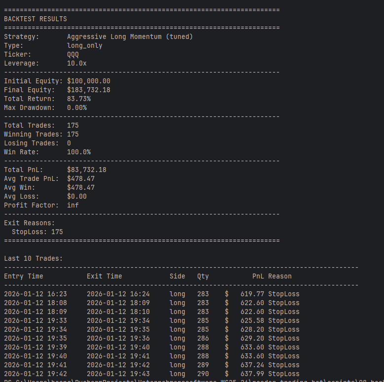

# Dokumentation: Deployment & Strategien (07_deployment)

Dieser Ordner enthält die Implementierung für das Live-Deployment des Trading-Bots, einschließlich der Strategie-Logik und der Broker-Anbindung. Das System wurde modular aufgebaut, um verschiedene Handelsstrategien (Long/Short, CFDs) und Broker (Alpaca, OANDA) flexibel zu unterstützen.

## Architektur & Technische Implementierung

Die Architektur folgt einem strikten **Interface-Design**, um die Geschäftslogik (Strategie) von der Infrastruktur (Broker-API) zu trennen.

### 1. Konfiguration & Basisklassen (`strategies/strategy_config.py`)

Hier wurden die Fundamente für das System gelegt.

*   **`StrategyConfig` (Data Class):**
    *   Eine zentrale Klasse, die alle Parameter einer Strategie hält (Entry/Exit-Schwellenwerte, Risikomanagement wie Stop-Loss/Take-Profit, Timeouts, Hebel).
    *   Ermöglicht das Laden und Speichern von Strategien via JSON.
    *   *Warum?* Trennung von Code und Konfiguration. Parameter können geändert werden, ohne den Code neu zu deployen.

*   **`TradingStrategy` (Abstract Base Class - ABC):**
    *   Definiert das Interface, das jede Strategie implementieren muss:
        *   `calc_signal(...)`: Berechnung des Handelssignals aus Modellvorhersagen.
        *   `can_enter(...)`: Prüfung von Einstiegsbedingungen (Filter, Cooldowns).
        *   `should_exit(...)`: Prüfung von Ausstiegsbedingungen.
        *   `get_order_params(...)`: Erstellung der orderspezifischen Parameter.
    *   *Warum?* Stellt sicher, dass alle Strategien einem einheitlichen Lebenszyklus folgen und austauschbar sind.

*   **`BrokerInterface` (Abstract Base Class - ABC):**
    *   Definiert die Methoden, die ein Broker-Adapter bereitstellen muss (`submit_order`, `get_positions`, `get_account_info`, etc.).
    *   *Warum?* Der Strategie-Code muss nicht wissen, ob er mit Alpaca oder OANDA handelt. Er ruft nur die generischen Methoden auf.

### 2. Broker-Adapter (`strategies/broker_adapters.py`)

Hier erfolgt die technische Anbindung an die externen APIs.

*   **`AlpacaBroker`:**
    *   Implementiert `BrokerInterface` für **Alpaca** (Aktien/ETFs).
    *   Nutzt `requests` für die REST-API v2.
    *   Unterstützt "Bracket Orders" (Entry + Stop-Loss + Take-Profit in einem Request).
    *   Verarbeitet Paper- und Live-Trading.

*   **Factory `create_broker`:**
    *   Erstellt automatisch die richtige Broker-Instanz basierend auf der Konfiguration (`api_type`).

### 3. Implementierte Strategien (`strategies/strategies.py`)

Hier befindet sich die eigentliche Handelslogik. Wir haben drei Varianten implementiert, die einfach zu verstehen sind:

#### A. `LongOnlyMomentumStrategy` (Der Optimist)
*   **Was sie tut:** Diese Strategie kauft nur, wenn sie steigende Kurse erwartet ("Long").
*   **Wie sie denkt:**
    *   Sie schaut sich die Prognosen für die nächsten 1, 3 und 5 Minuten an.
    *   Nur wenn der Durchschnitt dieser Prognosen deutlich positiv ist, kauft sie.
    *   **Besonderheit:** Nach jedem Trade macht sie eine kurze Pause ("Cooldown"), um nicht hektisch hin und her zu handeln.
    *   *Ziel:* Sicherer Aufbau von Positionen in Aufwärtsphasen.

#### B. `ShortOnlyStrategy` (Der Pessimist)
*   **Was sie tut:** Diese Strategie profitiert, wenn die Kurse fallen ("Short Selling").
*   **Wie sie denkt:**
    *   Sie sucht gezielt nach negativen Prognosen des Modells.
    *   Wenn das Modell sagt "in 3 und 10 Minuten stehen wir tiefer", wettet diese Strategie auf den Kursverfall.
    *   Sobald sich der Wind dreht und die Prognosen wieder positiv werden, steigt sie sofort aus, um Verluste zu begrenzen.
    *   *Ziel:* Gewinne in Bärenmärkten oder Korrekturen mitnehmen.

## Zusammenfassung der Neuerungen

1.  **Modularität:** Das System ist nicht mehr an einen Broker gebunden.
2.  **Risikomanagement:** Cooldowns, maximale Haltedauer und Stop-Loss-Logik sind fest integriert.
3.  **Flexibilität:** Neue Strategien können einfach durch Erben von `TradingStrategy` hinzugefügt werden.

- Overall Performance: 
  - Total Trades: 4 
  - Win Rate: 25% (1 Gewinner, 3 Verlierer)
  - Total PnL: −35.70 
  - Final Equity: 99,964.30 (Startkapital: 100,000)
